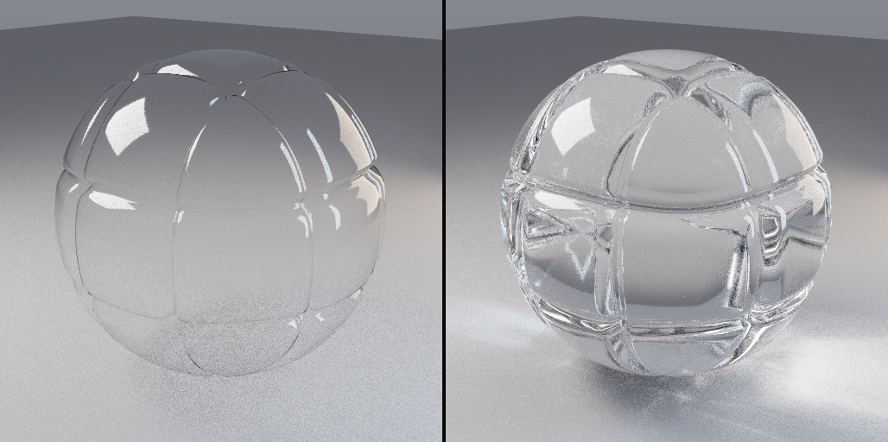

# Glass reflection and medium-state proof

## Scope

This exhibit documents the solid-glass reflection fix in
`Engine/Shaders/ReSTIRViewport.slang`. Sky reservoir candidate sampling is deliberately **not** part of this change.

The affected failure was a front-face glass reflection being marked as an interior-medium path. That caused the
reflection ray to receive Beer attenuation, use the wrong interface state, and sometimes terminate as black.

## Before the fix

```text
Camera
  │
  ▼
[solid glass front face]
  ├── Fresnel reflection ──► incorrectly marked "inside glass"
  │                           ├── Beer attenuation applied
  │                           └── reflected sky/object can become black
  └── transmission ─────────► correctly needs interior-medium state
```

The old path state used whether the primary material was solid glass as a proxy for whether the outgoing ray was
inside glass. Those are different facts: the reflection branch remains outside; only the transmitted branch enters.

## After the fix

```text
Camera ray starts outside
        │
        ▼
[solid glass interface]
   ┌────┴────┐
   │         │
Reflect   Transmit
   │         │
outside   enter medium
(no Beer)  (IOR + sigma_a carried)
             │
             ▼
       exact instance/material exit
             │
             ▼
       leave medium and continue
```

The shader now carries the active medium explicitly:

- opening instance identity
- opening material identity
- incident IOR
- Beer absorption coefficient
- fallback thickness for a missing exit hit

Beer attenuation is applied only to segments actually travelled inside that medium. Exit detection requires the exact
instance/material pair that opened the medium, so shared material slots cannot falsely close another glass object.

## Executed proofs

```text
[GlassPathState] GREEN — reflection/refraction medium-state regression checks passed
[MaterialsProof] GREEN — coverage + furnace pass
[shader-parity] GREEN — both build scripts lower the same 15 shaders
[BuildSourceList] GREEN — every hand-maintained source list names the same translation units
```

The materials furnace proof exercises the shared `MaterialEvaluation.slang` code as C++ and covers Fresnel,
refraction, total internal reflection, Beer absorption, thin-wall sampling, and solid-glass sampling.

The dedicated source gate is:

```text
bash Tools/Build/CheckGlassPathState.sh
```

## Visual material reference



`ShaderballSheet_SolidGlass.png` is the existing thin-wall versus solid-glass reference sheet from the material gallery.
It shows the intended clear-glass transport behaviour. The new path-state gate is the regression proof for the renderer
state fix; a new GPU capture still requires the shader toolchain and runtime GPU verification.

## Validation boundary

The sandbox did not contain `glslc`, `slangc`, or `glslangValidator`, so SPIR-V lowering was reported as skipped.
The full GPU visual A/B should be run after rebuilding `ReSTIRViewport.spv` on the Windows/Vulkan machine.
