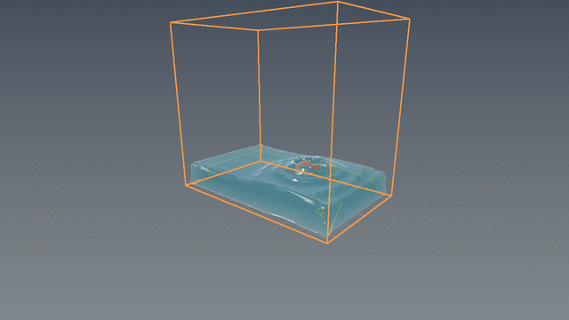
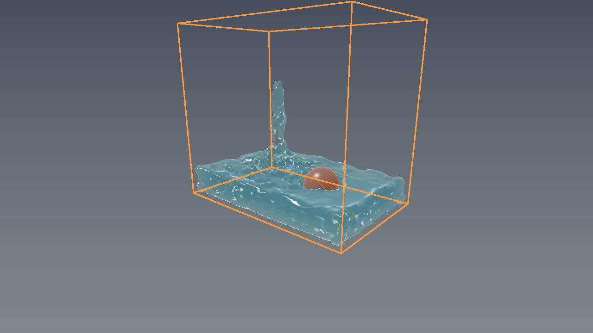
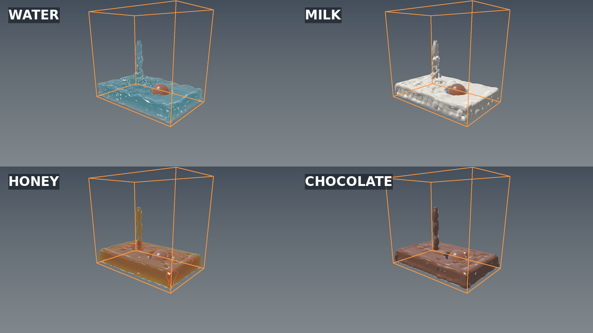

# Project Fluid — Flux PBF continuous-surface proof

Source: `eosclient0001-rgb/Frontier`, commit
`c708b47926dec2e31d08b2a0bc01ab15c84983c8`, branch
`arena/01a0c4da-frontier`.





## Material and optical response



The four panels are separate deterministic native runs at the same 1.50000 s
simulation budget with pouring enabled. They use the requested source commit's
base colour, absorption, opacity, roughness and IOR, while viscosity, surface
tension, wetting and shear thinning alter the corresponding simulation state.

These are native C++ execution outputs, not generated artwork or captures from
the removed ocean project. Weighted-covariance/PCA kernels are summed on a 3D
sparse-brick field, and the `0.075` isosurface is extracted with indexed Marching
Cubes. Vertices are welded by their global grid edge, producing zero open and
zero non-manifold edges in the recorded run. Normals come from the density-field
gradient. A mild Taubin pass is followed by exact global volume restoration.

The CPU proof rasterizes that actual mesh with front/back thickness, refraction,
Beer–Lambert attenuation, Fresnel response, and rough highlights. The OBJ beside
these images contains the same watertight surface. The Vulkan screen-space path
remains an explicitly documented interactive fallback until its mesh/RT upload
stage is completed.

The orange box is the real solver domain. The striped sphere is the source
scene's stationary obstacle and is depth-tested against the liquid. The visible
liquid separation around it comes from the same sphere non-penetration
projection used during pressure iterations.

## Recorded run

```text
Flux PBF C++ mirror | material Water | particles 1620 | t 1.50000 s
bounds [-1.95,1.95] x [0.19,3.70] x [-1.25,1.25] m
sphere contacts 0 | wall contacts 0 | minimum sphere distance 0.46668 m
pressure passes 3 | mean/peak compression 0.00245 / 0.02244
viscosity PCG iterations 1 | relative residual 0.00000
surface mesh: 15952 vertices | 32984 triangles
open/nonmanifold edges 0/0 | dirty bricks 288 initial / 0 unchanged
```

Build and reproduce:

```bash
g++ -std=c++20 -O3 -Wall -Wextra -Werror -Wpedantic \
  Projects/Project-Fluid/Source/PbfFluid.cpp \
  Projects/Project-Fluid/Source/SurfaceReconstruction.cpp \
  Projects/Project-Fluid/Source/AnisotropicSurfaceMesh.cpp \
  Projects/Project-Fluid/Source/CpuProofMain.cpp \
  -o /tmp/flux-proof
/tmp/flux-proof /tmp/flux.ppm 90 water \
  Exhibits/Project-Fluid/ProjectFluid_Flux_Surface_Mesh.obj
python3 Tools/PpmToPng.py /tmp/flux.ppm \
  Exhibits/Project-Fluid/ProjectFluid_Flux_PBF_Bounds_Collision.png
```

Checksums:

```text
82158dc9101d2e8641394c1ac7b27e6cb7160652641c7d97dc278e1457906f9c  ProjectFluid_Flux_PBF_Bounds_Collision.png
aa3527fd03cda4abe83debad72eccea9139f5c55f9c91aea72340fba67d8686a  ProjectFluid_Flux_PBF_Collision.gif
7ea103715540f278f0808a6d6f34592cc5d402c2d9d275e166d585256c3e172a  ProjectFluid_Flux_Surface_Material_Comparison.png
d6723b89e22a6ece93a2cfe19e68019f00ff78100735b31f819134c14e50f81a  ProjectFluid_Flux_Surface_Mesh.obj
```

The GIF samples twelve independently reproduced fixed-step states. The
interactive Vulkan window advances at 1/60 s, starts with pouring enabled,
supports reset/stir/pour/material input, and shows live contact counts.
