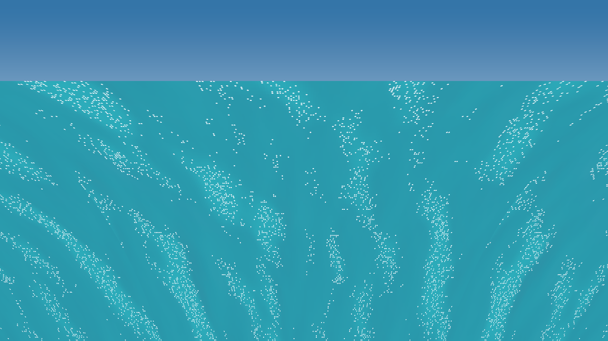

# Project Fluid execution proof



This is a real 1280x720 frame emitted in the Arena workspace by the native C++
`Project-Fluid-CPU` executable on 2026-09-21. It is not an AI-generated image,
HTML capture, or hand-authored mock-up.

## Reproduction command

```bash
g++ -std=c++20 -O3 -Wall -Wextra -Werror -Wpedantic \
  Projects/Project-Fluid/Source/SpectralOcean.cpp \
  Projects/Project-Fluid/Source/CpuMirrorMain.cpp \
  -o /tmp/project-fluid-test/cpu-mirror

/tmp/project-fluid-test/cpu-mirror \
  --render Exhibits/Project-Fluid/ProjectFluid_CPU_Mirror_Proof.ppm

python3 Tools/PpmToPng.py \
  Exhibits/Project-Fluid/ProjectFluid_CPU_Mirror_Proof.ppm \
  Exhibits/Project-Fluid/ProjectFluid_CPU_Mirror_Proof.png
```

Observed output:

```text
Project-Fluid CPU mirror: 192 shared spectral modes
height range [-0.9634, 0.9169] m, RMS 0.3498 m
CPU mirror proof rendered to Exhibits/Project-Fluid/ProjectFluid_CPU_Mirror_Proof.ppm
real 0m0.450s
```

PNG SHA-256:

```text
79a92324f033868bfc4ed12f27beb70d5b73662ac97a48f42150fdb93e84f0a4
```

## What this proves

- The native C++ spectral solver compiles and executes in this workspace.
- The deterministic 192-mode CPU mirror produces a finite 256x256 surface.
- The native C++ proof compositor can shade that surface and draw the discrete
  compression-driven foam particles used by the Vulkan presentation design.

## Honest GPU status

This image proves the **CPU mirror**, not a Vulkan GPU launch. The Arena sandbox
used for this run does not expose a Vulkan loader/device, GLFW runtime, CMake, or
`glslc`, so claiming a GPU capture here would be false. The Vulkan host was
syntax-compiled against current Vulkan/GLFW headers; its shaders and runtime
still require execution on a Vulkan-capable machine. `Projects/Project-Fluid`
prints CPU/GPU numerical parity results when that window runs.
